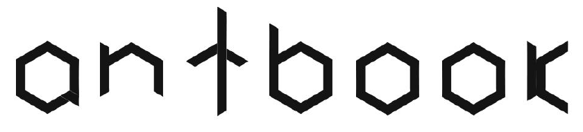

<div align="left">
  <br>
  
  <br>
</div>

# Antbook Project - The personal computer totally based on cloud computing
### Felipe González Vilches - Developed on March. 2018

The antbook project, as described in its abstract [file](https://github.com/fgvilches/antbook/blob/master/pj_ab_abs.pdf) consisted of designing a personal computer (accompanied by a subscription service) which was 100% based on cloud computing.
```
This project was developed during the first semester of 2018 by me and the Ant team, and although it did not reach more than a TRL 5 model and a paper (of which the abstract attached in this post is part and if you need it, feel free to write me an email) the idea is worth sharing, so I created the following post. 


Please consider that everything that follows was written and developed in 2018.
```

<div align="center">
  <br>
  
  <br>
</div>

### 🚀 First of all... some background

Today there is no technology company that does not have a product, solution or service adapted to the cloud. It is the most modern and current and it seems that whoever is not in the cloud will have nothing to do in the technological world in the future.
As an example of the above we have the most used data clouds, What would happen to University students when sending notes without the transmission of WhatsApp files or Airdrop?
Or even more without the co-work options of Google Drive? 
It is probably impossible to conceive the same workflow that is seen today in universities without such tools.

But, why if the cloud is "as powerful" as seen on paper, we continue to carry heavy computers to have a decent computing power and graphics card?


- [ ] Is it not possible what is suggested above?
- [ ] Didn't we think about it?
- [ ] Or is there a real limitation?

This is how in March 2018 I got to work to analyze if similar systems worked 100% "Cloud Based", and I found surprises such as the Nvidia Shield capable of streaming a large library of console games with the power of a cell phone. Or Latin American platforms such as GLOUD which (although at 720p) managed to stream smooth games and worked with a similar subscription system.
But the one that caught my attention was Parsec (the one without a subscription system) offered to stream your computers, consoles and others without inputlag, over long distances and with a 10mbps connection.

So, all of the above led me to think that there was no real limitation for not carrying out a cloud-based laptop, so I started to investigate the internet connection (That was perhaps the limitation by which something like this does not currently exist) and I found that the average speeds for 4g in Chile (My country) were 17.36Mbps of download and 8.55Mbps upload (According to Speedtest.net based on the average speed of Claro Chile on its 4g Network in the Metropolitan Region) and fixed connection ISP's have an average download of 52Mbps and 10Mbps of upload (According to Speedtest.net based on the average speed of Vtr Chile in its Fiber Optic Network in the Metropolitan Region), in this way It seems difficult to imagine that the internet could be a limitation.

In the end we do not find technological limitations today (even more thinking about a world that is preparing to receive 5G in the coming years **)

### ⚡️ Sooooooooo The Idea...

First of all I have to clarify that this task is not new at all, it is something that has been carried out within offices for years through a thin client structure (with protocols like PCOIP or RDP) connected to a single server where all the applications and programs run.


Wikipedia defines a Thin client as "lightweight computer that has been optimized for establishing a remote connection with a server-based computing environment. The server does most of the work, which can include launching software programs, performing calculations, and storing data"

Soooo the idea is to make a Personal computer based on a thin client  arq usign a motherboard with low computing power of type: Raspberry, Intel IoT Kit and/or similar, Amoled screen to reduce energy consumption, Lithium battery that generates an autonomy of about 3 hours (In that moment we knew it was little but we left it like that to keep the weight low).
On the connectivity side, must have Wifi, ethernet (Possibly similar to 3com's XJACK implementation), Bluetooth, GPS, 4G/5G (Depending on contact with operators).

All of the above would allow the antbook to be especially light and cheap.

### 🔌 On the SaaS Side...

The idea is a subscription service but a little different from those that currently exist as Netflix or Spotify (It should be noted that on the date this was written it was not my knowledge projects like Stadia) the service offers to the client different types of plans through which the user accesses greater computing power (Processor/Graphics Card/Ram) which obviously it's an aproximation because at the server level the same hardware names that the client commonly knows is not used.

The operating system must be ideally based in Linux (the distro will be selected later) in order to run Chromium and  predetermine the installation of Applications such as Google Docs, Google Slides and/or others for use when the user doesn't have access to Internet, In addition to facilitating the development of the local client that will reproduce the image of the server locally.

The data generated when the user is “Offline” will be stored in the eMMC storage of the machine that doesn't exceed 64gb or be less than 16gb. When the user connects to the Internet, this data will be uploaded to his Machine in the Cloud and will be kept inside his computer in the same way. An algorithm will determine according to use whether these files should be permanently deleted from local storage and passed only to storage on the Cloud Machine. In the event that the local files are photos or Music, a compression algorithm will be applied in order to leave a local sample of the file in case the user needs it. This Compressed Local Backup will remain as shown until the user deletes the original file on his Cloud Machine or manually deletes it from his local storage. The fact that all software runs on a Linux distro allows us to easily create a TinyApps Free Store (Basicly a Package manager) in order to meet offline (for when the user don't have access to the internet or didn't pay for their subscription) needs  of users, (Small photo editor, Small Rar/Zip Compressor) Some easily portable from Free Source Programs.

**Platform**: The user must be able to access it using a “Go to Platform” button in the login window when turning on their Antbook.
When accessing the platform you must be able to modify your account type (prepaid - post-payment) in addition to being able to modify
the equipment plan (among those described below). Being a Prepaid user, you must be able to buy credits to add to your account.
The Connectivity option (wifi, 4g / 5g, Bluetooth) must be enabled within the platform so that the user can access these options.

### ✨ Bottomline

**Why is this necessary?**: In today's world, the Antbook becomes necessary to respond to the needs of **connectivity** and **portability** since we could carry a very high computing power (even computing power unimagined to easily transport).

**Portability**: We could simply forget to take our Antbook if in the place where we are going we know that there will be another one, since thanks to the platform we would simply login with our user and continue working from where we left off when we were at home, because it's cloud computing.

**Security**: With Antbook security would no longer be something to worry about, since in case of some theft, our Antbook would be easy to triangulate with his GPS module and within it, the local data would be encrypted within the equipment. It should be remembered that our complete PC would continue to be in the cloud, so in case of not recovering it, we would only have to replace the device and our PC would continue as we left it on the last day we saw it. Safe and reliable.

**Support**: Support is a plus in the Antbook, since being a pc that lives within a technical environment, the user would have full support. In addition, you could always generate Support Tickets to request help which would be answered shortly.

**Bottomline**: All This would benefit Designers, Engineers, Gamers, Producers, Advertisers, Programmers and countless people who need great computing power and portability at the same time or people who simply want to ensure the security of their information.

--
Aaaaaand basically this is the end of the post, if you are interested in how this project continued or you want to get the original paper (it is in Spanish btw) do not hesitate to write me an email to --> hola@fgvilches.info. 

That's all, See ya sound🔈!

--
```

     |` _   .| _|_  _  _
    ~|~(_|\/||(_| |(/__\
        _|         
© Project incubated in March 2018, Re-edited on Nov. 2019.
```
